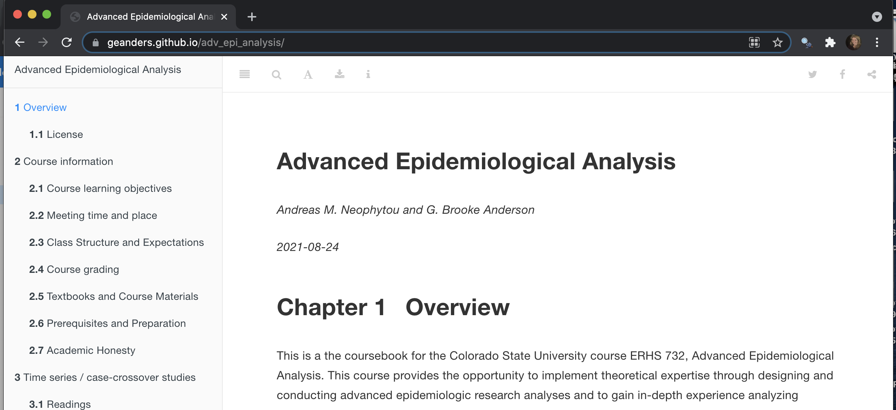
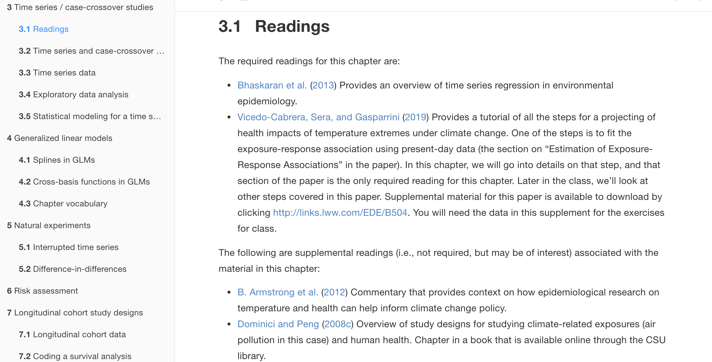

```{r setup, include=FALSE}
knitr::opts_chunk$set(echo = FALSE)
```


## Course Aims

This course provides the opportunity **to
implement theoretical expertise** through designing and conducting advanced
epidemiologic research analyses and **to gain in-depth experience analyzing
datasets** from the environmental epidemiology literature. 

This course will
**complement the student's training in advanced epidemiological methods**,
leveraging regression approaches and statistical programming, providing the
opportunity to implement their theoretical expertise through designing and
conducting  advanced epidemiologic research analyses. 

Although basic theoretical frameworks behind analysis and statistical modeling approaches will be introduced, this course will not go into depth into statistical and epidemiologic theory and students are expected to be familiar with general epidemiologic concepts such as confounding, selection bias etc.

## Topics

1. Time series studies in environmental epidemiology
2. Observational cohort studies in epidemiology

## Topics

```{r echo = FALSE, message = FALSE, warning = FALSE}
library(tidyverse)
library(knitr)

tribble(
  ~ `Study type`, ~ `Topic`, ~ `Class`,
  "Time series", "Time series / case-crossover study designs", "1--2",
  "Time series", "Generalized linear models", "3--4",
  "Time series", "Natural experiments", "5",
  "Time series", "Risk assessment", "6",
  "Time series", "Group midterm reports", "7",
  "Cohort", "Longitudinal cohort study designs", "8--9",
  "Cohort", "Inverse probability weighting, Propensity scores", "10", 
  "Cohort", "Mixed models", "11", 
  "Cohort", "Instrumental variables", "12", 
  "Cohort", "Counterfactuals / Causal inference", "13", 
  "Cohort", "Finals prep and presentation", "14--15"
) %>% 
  kable()
```

## Online Coursebook

```{r out.width = "\\textwidth"}

```

\medskip
\centering
\url{https://geanders.github.io/adv_epi_analysis/}

## Required Reading

Required reading will include sections of the online coursebooks, as well as 
peer-reviewed articles,
which are listed in the coursebook at the start of each chapter.

```{r out.width = "\\textwidth"}

```

## Required Reading

```{r}
tribble(
  ~ `Class Date`, ~ `Coursebook reading`, 
  "August 30", "3.1--3.4", 
  "September 3", "3.5", 
  "September 13", "4.1"
) %>% 
  kable()
```

## In-class Schedule

- **Topic overview**: Each class will start with a brief overview of the week's
    topic. This will focus on the material covered in that week's assigned 
    reading in the online book and papers.
- **Discussion of analysis and coding points**: Students and faculty will be
    divided into small groups to discuss the assigned reading and think more deeply about
    the content.  This is a time to bring up questions and relate the chapter
    concepts to other datasets and/or analysis methods you are familiar with.
- **Group work**: In small groups, students will work on designing an
    epidemiological analysis for the week's topic and developing code to 
    implement that analysis. This will follow the prompts given in the assigned
    reading from the online book for the week.
- **Wrap-up**: We will reconvene as one group at the end to discuss topics that
    came up in small group work and to outline expectations for students before
    the next meeting.

## Grading

```{r echo = FALSE, message = FALSE, warning = FALSE}
library(tidyverse)
library(knitr)

tribble(
  ~ `Assessment Components`, ~ `Percentage of Grade`, 
  "Midterm written report", 30, 
  "Midterm presentation", 15, 
  "Final written report", 30, 
  "Final presentation", 15, 
  "Participation in in-course exercises", 10
) %>% 
  kable()
```

## Midterm Report

Students will work in groups to  prepare an **oral presentation** and accompanying **written report** presenting an epidemiologic
analysis using a time series dataset similar to the London dataset used
for the first half of the course. The group may pick a research question
based on the topics covered in the first half of the course.

These Midterm reports will be due (and presented) the eighth week of class
(seventh class session, since there will be no class for Labor Day).

## Midterm Report

The **presentation**
should be 15 minutes and should be structured like a conference presentation
(Introduction, Methods, Results, and Discussion). 

The **written report**
should be approximately six pages (single spaced) and should cover the
same topics. It should include at least two (up to four) well-designed figures and / or
tables. The written report should be created following reproducible
research principles and using a bibliography referencing system (e.g., 
BibTex if the student uses RMarkdown to write the report). The report
should be written to the standard expected for a peer-reviewed 
publication in terms of clarity, grammar, spelling, and referencing.

## Participation

Attendance is an essential part of participating
in the class.  We understand things come up, however it is expected you
attend every class and come prepared. Further, it is expected that you will
actively participate in discussions and group work during the class period.

It is expected that *before* coming to class, students will read the required
papers for the week, as well as the online book sections assigned for the week.
Reading assignments will be announced the week before each class session.
Students should come to class prepared to prepared to do
statistical programming (i.e., bring in a laptop with statistical software,
download any datasets needed for the week).


## Make-up Class

We will hold a make-up class this Friday, **September 3, 10:00--11:40 AM**. 

We will meet in the Environmental Health classroom (Room 120).
